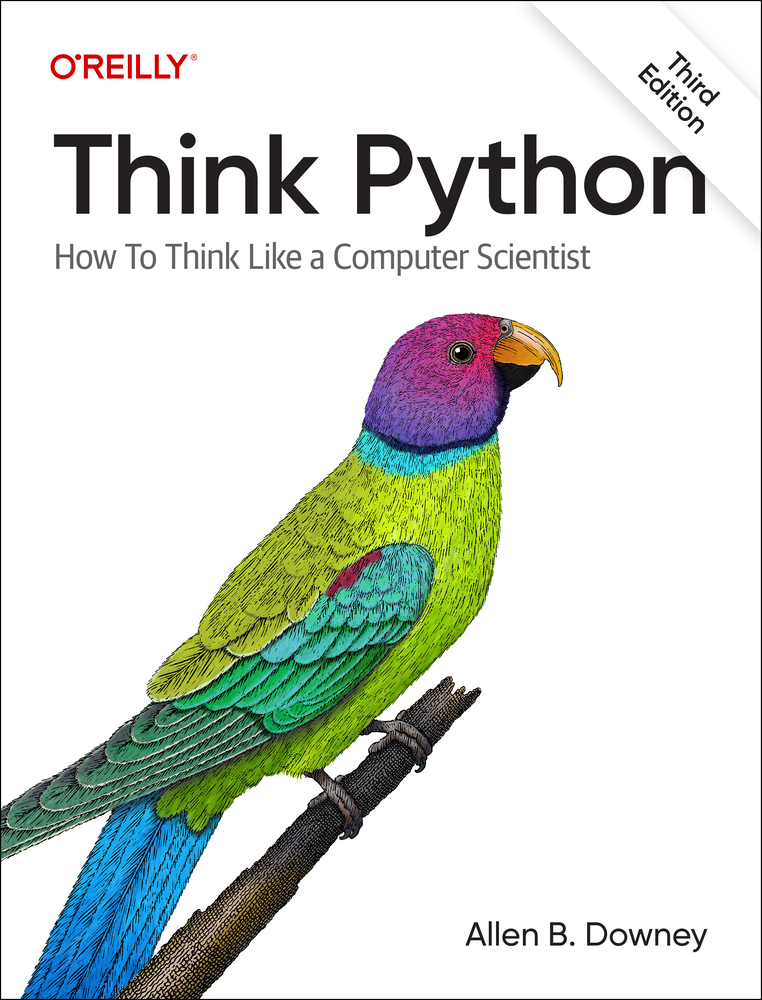
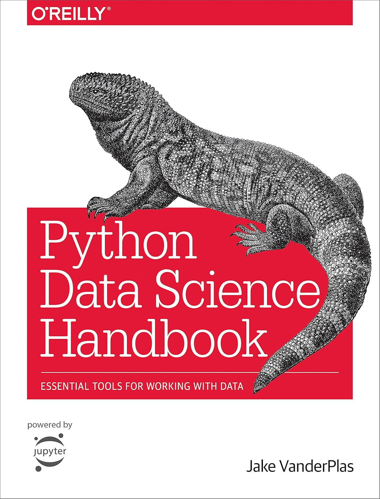

<h1 align="center">Python</h1>

## Learning Foundations with: `Think in Python`

### [Link to the book](https://allendowney.github.io/ThinkPython/index.html)

## Learn How Manipulate Data with: `Python Data Science Handbook`

### [Link to the book](https://jakevdp.github.io/PythonDataScienceHandbook/)
