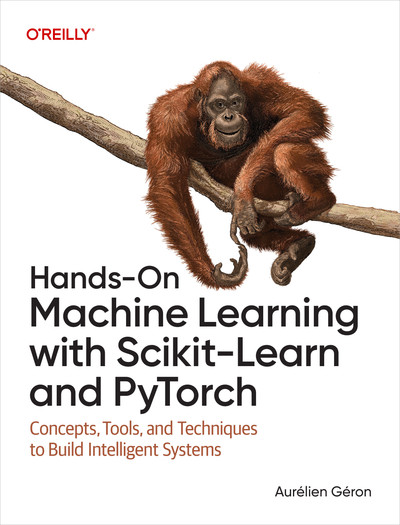

# Hands-On Machine Learning with Scikit-Learn and PyTorch

El potencial del aprendizaje automático hoy en día es extraordinario, pero muchos aspirantes a desarrolladores y profesionales de la tecnología se sienten intimidados por su complejidad. Tanto si buscas mejorar tus habilidades y aplicar el aprendizaje automático a proyectos reales como si simplemente tienes curiosidad por saber cómo funcionan los sistemas de IA, este libro es tu punto de partida.

Con un estilo accesible pero sumamente informativo, el autor Aurélien Géron ofrece la guía introductoria definitiva al aprendizaje automático y al aprendizaje profundo. Basándose en el ecosistema de Hugging Face, y centrándose en explicaciones claras y ejemplos prácticos, el libro te guía a través de herramientas de vanguardia como Scikit-Learn y PyTorch, desde técnicas básicas de regresión hasta redes neuronales avanzadas. Tanto si eres estudiante, profesional o aficionado, adquirirás las habilidades necesarias para construir sistemas inteligentes.

- Comprender los fundamentos del aprendizaje automático, incluidos conceptos como el sobreajuste y la optimización de hiperparámetros.
- Completa un proyecto de aprendizaje automático de principio a fin utilizando scikit-learn, abarcando todo, desde la exploración de datos hasta la evaluación del modelo.
- Aprende técnicas de aprendizaje no supervisado, como la agrupación y la detección de anomalías.
- Crea arquitecturas avanzadas como transformadores y modelos de difusión con PyTorch.
- Aprovecha el poder de los modelos preentrenados, incluidos los LLM, y aprende a ajustarlos.
- Entrenar agentes autónomos mediante aprendizaje por refuerzo

