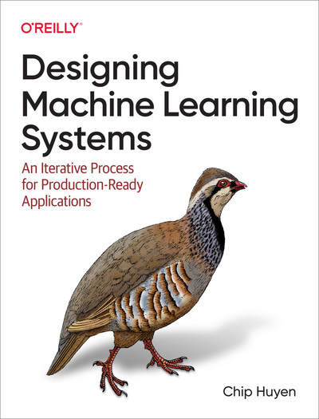

# Designing Machine Learning Systems

Los sistemas de aprendizaje automático son complejos y únicos. Complejos porque constan de muchos componentes diferentes e involucran a diversos actores. Únicos porque dependen de los datos, los cuales varían enormemente de un caso de uso a otro. En este libro, aprenderá un enfoque integral para diseñar sistemas de aprendizaje automático que sean confiables, escalables, fáciles de mantener y adaptables a entornos y requisitos empresariales cambiantes.

El autor Chip Huyen, cofundador de Claypot AI, analiza cada decisión de diseño —como el procesamiento y la creación de datos de entrenamiento, las características a utilizar, la frecuencia de reentrenamiento de los modelos y los parámetros a monitorizar— en función de cómo puede contribuir a que el sistema en su conjunto alcance sus objetivos. El marco iterativo de este libro se basa en estudios de caso reales respaldados por numerosas referencias.

Este libro te ayudará a afrontar situaciones como las siguientes:

- Ingeniería de datos y elección de las métricas adecuadas para resolver un problema empresarial.
- Automatizar el proceso para el desarrollo, evaluación, implementación y actualización continua de modelos.
- Desarrollar un sistema de monitorización para detectar y solucionar rápidamente los problemas que puedan surgir en sus modelos durante la producción.
- Diseño de una plataforma de aprendizaje automático que sirva para diversos casos de uso.
- Desarrollo de sistemas de aprendizaje automático responsables

