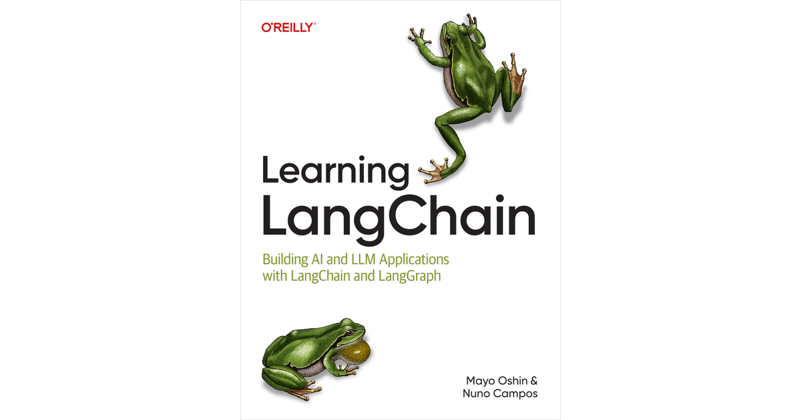

# Learning LangChain

Si buscas crear aplicaciones de IA listas para producción que puedan razonar y recuperar datos externos para comprender el contexto, necesitarás dominar LangChain, un popular marco de desarrollo y plataforma para crear, ejecutar y administrar aplicaciones con agentes. LangChain es utilizado por varias empresas líderes, como Zapier, Replit, Databricks y muchas más. Esta guía es un recurso indispensable para desarrolladores que entienden Python o JavaScript, pero que son principiantes deseosos de aprovechar el poder de la IA.

Los autores Mayo Oshin y Nuno Campos desmitifican el uso de LangChain mediante consejos prácticos y tutoriales detallados. Partiendo de conceptos básicos, este libro le muestra paso a paso cómo crear un agente de IA listo para producción que utilice sus datos.

Aproveche el poder de la generación aumentada por recuperación (RAG) para mejorar la precisión de los LLM utilizando datos externos actualizados.
Desarrollar e implementar aplicaciones de IA que interactúen de forma inteligente y contextual con los usuarios.
Aproveche la potente arquitectura de agentes con LangGraph.
Integre y gestione API y herramientas de terceros para ampliar la funcionalidad de sus aplicaciones de IA.
Supervise, pruebe y evalúe sus aplicaciones de IA para mejorar el rendimiento.
Comprenda los fundamentos del desarrollo de aplicaciones LLM y cómo se pueden utilizar con LangChain.