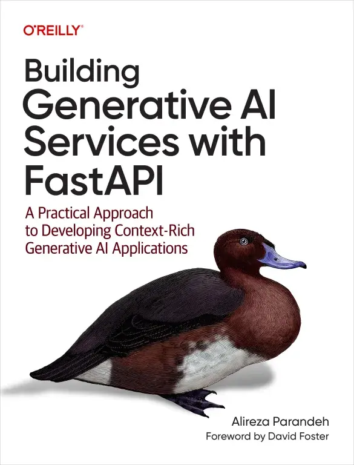

# Building Generative AI Services with FastAPI

[Codigo del libro aqui](https://github.com/NicolasJoseGula/Book-AI-Code/tree/main/Building%20Generative%20Services%20with%20FastAPI)

¿Listo para crear aplicaciones de nivel profesional con IA generativa? Esta guía práctica te acompaña en el diseño e implementación de servicios de IA utilizando el framework web FastAPI. Aprende a integrar modelos que procesan texto, imágenes, audio y video, interactuando sin problemas con bases de datos, sistemas de archivos, sitios web y API. Ya seas desarrollador web, científico de datos o ingeniero de DevOps, este libro te brinda las herramientas para crear aplicaciones de IA escalables y en tiempo real.

El autor Alireza Parandeh ofrece explicaciones claras y ejemplos prácticos sobre autenticación, concurrencia, almacenamiento en caché y generación aumentada de recuperación (RAG) con bases de datos vectoriales. También explorará las mejores prácticas para probar los resultados de la IA, optimizar el rendimiento y proteger los microservicios. Gracias al despliegue en contenedores con Docker, podrá lanzar aplicaciones con IA en la nube con total confianza.

Desarrollar servicios de IA generativa que interactúen con bases de datos, sistemas de archivos, sitios web y API.

Gestionar la concurrencia en cargas de trabajo de IA y manejar tareas de larga duración.

Transmita resultados generados por IA en tiempo real a través de WebSocket y eventos enviados por el servidor.

Servicios seguros con autenticación, filtrado de contenido, limitación de velocidad y restricción de ancho de banda.

Optimice el rendimiento de la IA con técnicas de almacenamiento en caché, procesamiento por lotes y ajuste fino.

